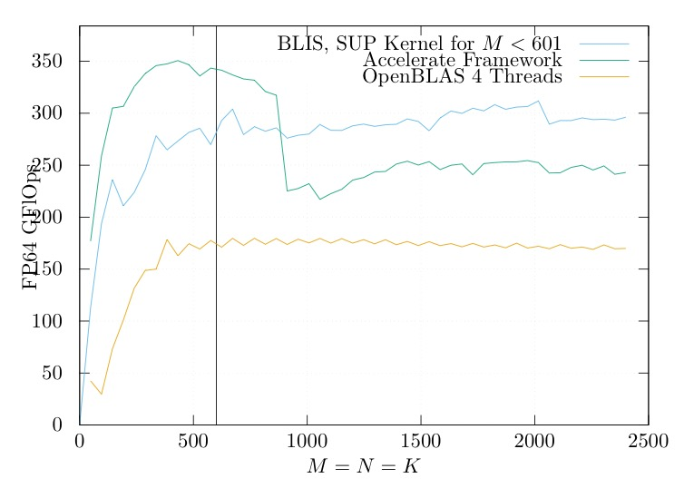
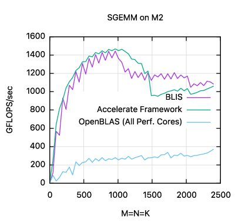

Current MD file explains this port of BLIS to Apple's matrix coprocessor.

- Here is the original BLIS [README](README_BLIS.md).

As of Jul., 2021, the coprocessor is undocumented but not protected either. (Any user / program is allowed to invoke this coprocessor and it's supposed to be safe.) This work is based on Dougall Johnson's effort on analyzing the related instructions.

Known issues:
- Generic-strided is not supported by our microkernels for the destination matrix. Program would `assert(false)` upon encountering such a situation.
- TRSM might fail. Try commenting out function call to `bli_cntx_set_packm_kers` in `config/aaplmx/bli_cntx_init_aaplmx.c` if your need TRSM to work.

Performance:

  
  

